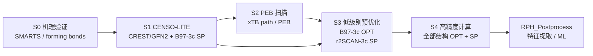

# RPH S0–S4 破坏性架构重构设计

状态：设计稿 v2（S1 固定为 CENSO-LITE）  
适用版本：RPH v4 architecture  
范围：ReactionProfileHunter 主仓库（S0–S4 计算流程）  
下游：RPH_Postprocess 负责特征提取与 ML 数据整理

## 1. 重构目标

当前版本存在三个结构性问题：

1. S1 构象搜索后继续执行 DFT OPT/SP，计算职责过重。
2. S2 生成结构后，S3 使用 M062X 进行 TS、反应物和中间体优化；M062X 数值格点、`CalcAll` 和 TS 收敛问题会直接阻断流程。
3. S3 同时承担 TS 搜索、QST2 rescue、IRC、SP 矩阵、热化学和下游特征准备，导致步骤职责混杂、失败不可隔离、死代码和兼容代码大量累积。

本次采用破坏性重构，不保留旧 S1 DFT handoff、旧 S3 TS rescue 链和旧目录别名。旧工作目录不自动复用，必须从新 schema 重新运行或通过外部迁移脚本处理。

## 2. 新的计算边界



| 步骤 | 唯一职责 | 禁止职责 |
|---|---|---|
| S0 | 机理分类、形成键验证、原子映射 | 几何优化、能量计算 |
| S1 | CENSO-LITE：CREST/GFN2 构象搜索、xTB 热校正、B97-3c SP 排序 | DFT OPT、DFT FREQ、RSH 高精度 SP |
| S2 | PEB/path 扫描，提取峰值和中间体种子 | DFT 预优化、S2 rescue DFT |
| S3 | 对结构执行低级别 OPT + SP，保存低级别基线 | M062X、QST2、IRC、SP 矩阵 |
| S4 | 对 manifest 中全部结构执行高精度 OPT + SP | 重新推断 forming bonds、静默丢弃失败结构 |
| Postprocess | 特征提取、质量筛选、ML 数据表 | 反向修改 RPH 计算状态 |

## 3. 新目录规范

每个任务目录必须包含 `.rph_schema.json`，用于拒绝旧架构的检查点：

```text
run_dir/
├── .rph_schema.json
├── pipeline.state
├── S0_Mechanism/
│   ├── mechanism.json
│   ├── atom_map_smiles.json
│   └── status.json
├── S1_ConfSearch/
│   ├── product/
│   │   ├── candidates/
│   │   │   ├── conf_0001.xyz
│   │   │   └── conf_0002.xyz
│   │   ├── ensemble.xyz
│   │   ├── selected.xyz
│   │   └── manifest.json
│   ├── precursor/
│   └── manifest.json
├── S2_PEB/
│   ├── peb_path.xyz
│   ├── peb_profile.json
│   ├── peb_peak.xyz
│   ├── intermediate_seed.xyz
│   ├── mechanism.json
│   └── manifest.json
├── S3_LowLevel/
│   ├── product/
│   ├── candidates/
│   ├── intermediate/
│   ├── ts/
│   ├── manifest.json
│   └── status.json
├── S4_HighLevel/
│   ├── product/
│   ├── candidates/
│   ├── intermediate/
│   ├── ts/
│   ├── manifest.json
│   └── status.json
└── logs/
```

### 3.1 结构目录规范

每个结构目录使用统一文件名：

```text
structure/
├── input.xyz
├── opt.xyz                 # 优化成功时存在
├── opt.log / opt.out
├── opt.chk / opt.fchk      # 引擎支持时保留
├── sp.out / sp.log
├── sp.json
└── status.json
```

结构命名约定：

```text
product_conf_0001
product_conf_0002
intermediate
ts_peb_peak
precursor_conf_0001
fragment_0001
```

不得再使用 `reactant_complex.xyz`、`ts_final.xyz`、`S3_TransitionAnalysis/` 等旧别名作为新流程的规范名称。

## 4. Manifest 规范

### 4.1 S1 manifest

S1 必须输出全部经过 xTB/CREST 搜索和 CENSO-LITE 二面角去重后的候选结构，而不是只返回一个全局最低能结构。

```json
{
  "schema_version": "s1_manifest_v1",
  "stage": "S1",
  "molecule": "product",
  "ranking_method": "gfn2_xtb",
  "candidates": [
    {
      "id": "product_conf_0001",
      "xyz": "product/candidates/conf_0001.xyz",
      "energy_hartree": -123.456,
      "relative_energy_kcal": 0.0,
      "gfn2_energy_hartree": -123.460,
      "b973c_sp_energy_hartree": -123.455,
      "xtb_mrrho_correction_hartree": 0.001,
      "s1_score_hartree": -123.454,
      "torsion_signature": "C3-C4:anti|C7-C8:gauche",
      "source": "crest_gfn2",
      "status": "valid"
    }
  ]
}
```

S1 使用 B97-3c 单点进行低成本 GGA 排序，并使用 xTB Hessian/mRRHO 热校正；不执行 DFT 几何优化、FREQ 或高精度 RSH SP。

### 4.2 S2 manifest

```json
{
  "schema_version": "s2_peb_manifest_v1",
  "stage": "S2",
  "forming_bonds": [[3, 8], [4, 12]],
  "index_base": 0,
  "peb_path": "peb_path.xyz",
  "peb_peak": "peb_peak.xyz",
  "intermediate_seed": "intermediate_seed.xyz",
  "scan_profile": "peb_profile.json",
  "status": "complete"
}
```

S0 输出的 `forming_bonds` 是唯一权威来源，S2 不得重新推断并覆盖形成键。

### 4.3 S3/S4 manifest

S3 和 S4 使用同一套结构记录格式：

```json
{
  "schema_version": "structure_stage_manifest_v1",
  "stage": "S3",
  "structures": [
    {
      "id": "ts_peb_peak",
      "kind": "ts",
      "input_xyz": "../S2_PEB/peb_peak.xyz",
      "opt_xyz": "ts/opt.xyz",
      "sp_output": "ts/sp.out",
      "opt_energy_hartree": null,
      "sp_energy_hartree": -234.567,
      "opt_status": "degraded",
      "sp_status": "complete",
      "fallback_xyz": "../S2_PEB/peb_peak.xyz",
      "usable_for_ml": true,
      "errors": ["low-level TS optimization did not converge"]
    }
  ]
}
```

允许的状态：

```text
pending → running → complete
                    ↘ degraded
                    ↘ failed
```

单个结构的 `failed` 不应导致整个 S3/S4 任务失败。只有 manifest 无法生成或所有结构均无可用输入时，步骤才整体失败。

## 5. S0–S4 参数规范

所有方法、引擎、资源和 rescue 参数必须位于 `config/defaults.yaml`，代码不得硬编码。

### 5.1 S0

```yaml
s0:
  enabled: true
  mechanism_validation: true
  forming_bonds_required: true
  index_base: 0
```

### 5.2 S1

```yaml
step1:
  protocol: censo_lite
  output_all_candidates: true
  max_candidates: null

  censo_lite:
    crest:
      engine: crest
      gfn_level: 2
      search_mode: imtd_smtd
      energy_window_kcal: 6.0
      solvent: acetone
      solvation_model: alpb

    # CENSO-LITE 的 ensemble ranking；只做 SP，不做几何 OPT
    ranking:
      engine: orca
      method: B97-3c
      task: single_point
      solvent: acetone
      score: "E_B97-3c_SP + delta_G_xTB_mRRHO"

    xtb_thermo:
      enabled: true
      engine: xtb
      bhess: true
      evaluate_rrho: true
      consider_sym: true
      sthr: 50.0
      imagthr: automatic

    deduplication:
      backend: torsion_signature
      heavy_atom_rmsd_prefilter_A: 0.25
      torsion_bin_deg: 20.0
      torsion_rmsd_deg: 25.0
      preserve_stereochemistry: true
      preserve_mirror_pairs: true

    retention:
      energy_window_kcal: 6.0
      always_keep_lowest: true
      retain_all_torsion_signatures: true

  # 任何旧协议均不再接受
  allowed_protocols: [censo_lite]
```

删除 `protocol_stack`、`shared_handoff`、`final_opt_sp`、`two_stage_enabled`、`stage1_gfn0`、`stage2_gfn2`、S1 fast-SP profiles 以及所有 `ext/default/full/zero` 分支。S1 的 B97-3c SP 是 CENSO-LITE 的低成本排序步骤；高精度 RSH OPT/SP 仍由 S4 执行。

### 5.2.1 CENSO-LITE 的 V4 映射

Grimme 的 CENSO-LITE 核心顺序是：

```text
CREST/GFN2-xTB 构象搜索与几何优化
        ↓
B97-3c/GGA 单点排序
        ↓
高精度 RSH 单点精修最低能结构
```

V4 将最后一步显式移动到 S4，并扩展为对 S4 manifest 中全部结构执行高精度 OPT + SP：

```text
S1: CREST/GFN2 + B97-3c SP + xTB-mRRHO 排序
S2: PEB 扫描
S3: B97-3c OPT + r2SCAN-3c SP
S4: 高精度 OPT + wB97M-V SP
```

因此 S1 的 `B97-3c SP` 不是当前 S3 的 `B97-3c OPT`，也不是 S4 的高精度计算。S1 的目标只是以较低成本选择反应路径和 S4 候选结构。

### 5.2.2 取消 ISOSTAT 的能量排序职责

ISOSTAT 不再参与 S1 的最终排序，也不再决定候选结构是否因“能量相近”而被删除。原因是笛卡尔 RMSD/能量聚类不能可靠表达二面角旋转，可能把不同 rotamer 合并，也可能因能量字段解析或排序顺序不稳定而丢失低能二面角状态。

V4 使用 `TorsionAwareDeduplicator`：

1. 从 RDKit 分子图确定可旋转键；排除环键、酰胺键、末端伪旋转键和用户指定的保护键。
2. 对每个候选结构计算有符号二面角，并统一到 `[-180°, 180°)`。
3. 对二面角使用循环距离，不能使用普通绝对值距离；例如 `179°` 与 `-179°` 的距离应为 `2°`。
4. 生成稳定的 `torsion_signature`，默认二面角 bin 为 `20°`。
5. 只有在分子图一致、立体化学一致、重原子 RMSD 小且二面角签名等价时才去重。
6. 相同签名内保留 `G_s1` 最低的结构；不同签名即使笛卡尔 RMSD 较小也必须保留。
7. 二面角签名只负责去重，不负责能量排序；最终排序只能使用：

   ```text
   G_s1 = E_B97-3c_SP + delta_G_xTB_mRRHO
   ```

8. 镜像结构、手性中心变化和反应相关立体异构体默认保留，不得被 RMSD 聚类自动合并。

建议新增模块：

```text
rph_core/steps/conformer_search/torsion_signature.py
rph_core/steps/conformer_search/deduplicator.py
```

`isostat_runner.py`、ISOSTAT 可执行文件配置和 `clustering_mode: isostat` 在 S1 重构完成后删除。若保留 ISOSTAT 作为调试对照，它只能写入诊断结果，不能改变 S1 manifest。

### 5.3 S2

```yaml
step2:
  engine: peb
  forming_bonds_required: true
  preoptimization:
    enabled: false

  scan:
    engine: xtb
    mode: peb
    scan_policy: policy_c
    scan_start_distance: 3.5
    scan_end_distance: 1.8
    scan_steps: 20
    scan_force_constant: 0.5

  path_search:
    mode: rescue
```

删除 `pes_adapter`、`relax_method` 和所有 S2 DFT 预优化字段。

### 5.4 S3 低级别计算

```yaml
theory:
  s3_low_level:
    optimization:
      method: B97-3c
      basis: ""
      engine: gaussian
      solvent: acetone
      route_minimum: "Opt=CalcFC"
      route_ts: "Opt=(TS,CalcFC,NoEigenTest)"
      max_cycles: 100

    single_point:
      method: r2SCAN-3c
      basis: ""
      engine: orca
      solvent: acetone

step3:
  enabled: true
  continue_on_structure_failure: true
  calculate:
    - product_candidates
    - intermediate
    - ts
```

S3 默认不执行：

```text
Freq
QST2
IRC
CalcAll
SP matrix
Gibbs/thermochemistry
NBO
```

### 5.5 S4 高精度计算

```yaml
theory:
  s4_high_precision:
    optimization:
      method: M062X
      basis: def2-SVP
      engine: gaussian
      solvent: acetone
      route_minimum: "Opt"
      route_ts: "Opt=(TS,CalcFC,NoEigenTest)"
      grid: UltraFine
      scf: XQC
      max_cycles: 200

    single_point:
      method: wB97M-V
      basis: def2-TZVPP
      aux_basis: def2/J
      engine: orca
      solvent: acetone

step4:
  enabled: true
  calculate_all_manifest_structures: true
  continue_on_structure_failure: true
  fallback_to_s3_geometry: true
  frequency:
    enabled: false
```

S4 的高精度优化可以继续使用当前 M062X，但必须显式配置数值格点、SCF 和最大迭代次数。M062X 失败时不得覆盖 S3 结果；可在 S4 中对同一输入执行 SP fallback，并将结果标记为 `opt_failed_sp_complete`。

## 6. 代码重构与死代码清理

### 6.1 保留并复用

```text
rph_core/steps/mechanism_classifier/
rph_core/steps/conformer_search/candidates.py
rph_core/steps/conformer_search/state_manager.py
rph_core/steps/conformer_search/xtb_thermo.py
rph_core/steps/step2_retro/bond_stretcher.py
rph_core/steps/step2_retro/scan_policies.py
rph_core/utils/qc_interface.py
rph_core/utils/qc_task_runner.py
rph_core/utils/geometry_tools.py
rph_core/utils/file_io.py
rph_core/utils/path_compat.py
rph_core/utils/checkpoint_manager.py
rph_core/utils/config_loader.py
rph_core/utils/resource_utils.py
```

### 6.2 重写

```text
rph_core/orchestrator.py
rph_core/steps/contracts.py
rph_core/steps/runners.py
rph_core/utils/layout_contract.py
rph_core/steps/conformer_search/engine.py
rph_core/steps/step2_retro/retro_scanner.py → peb_scanner.py
rph_core/steps/conformer_search/funnel.py → censo_lite.py
rph_core/steps/conformer_search/protocols.py → 删除多协议解析，仅保留 CensoLiteConfig
```

新增：

```text
rph_core/steps/step3_lowlevel/
  engine.py
  models.py

rph_core/steps/step4_highlevel/
  engine.py
  models.py
```

### 6.3 删除

```text
rph_core/steps/anchor/
rph_core/steps/conformer_search/pipeline/executor.py
rph_core/steps/conformer_search/pipeline/stages/final_opt_sp.py
rph_core/steps/conformer_search/pipeline/stages/
rph_core/steps/conformer_search/isostat_runner.py
rph_core/steps/step2_retro/preopt_driver.py
rph_core/steps/step3_opt/
```

同时删除以下逻辑和字段：

```text
AnchorPhase 中的 DFT handoff
ConformerEngine._run_shared_dft_handoff()
ConformerEngine._run_dft_opt_sp_for_candidates()
ConformerEngine._step_dft_opt_sp_coupled()
protocol_stack.*.handoff
protocol_stack.*.final_opt_sp
protocol_stack.ext
protocol_stack.default
protocol_stack.full
protocol_stack.lite
protocol_stack.zero
step1.shared_handoff
step1.fast_sp_profiles
step1.conformer_search.stage1_gfn0
step1.conformer_search.stage2_gfn2
step1.conformer_search.clustering.isostat
executables.isostat
theory.optimization 作为全局方法的旧读取路径
theory.single_point 作为全局方法的旧读取路径
e_product_l2
SPMatrixReport
QST2 rescue
IRC rescue
S3 thermochemistry
S3 forming_bonds resolver fallback
```

### 6.4 `QCTaskRunner` 最小改造

不再为 S3 和 S4 各实现一套 OPT/SP 代码。统一扩展现有接口：

```python
run_opt_sp_cycle(
    input_xyz: Path,
    output_dir: Path,
    theory_opt: Dict[str, Any],
    theory_sp: Dict[str, Any],
    structure_kind: str,  # minimum | ts
    allow_sp_fallback: bool = True,
)
```

所有 Gaussian、ORCA、xTB 调用仍必须经过 `qc_interface.py`，不得在新步骤中直接调用 `subprocess.run`。

## 7. Orchestrator 新流程

`run_pipeline()` 简化为五个固定调用：

```python
s0 = run_s0(product_smiles, work_dir)
s1 = run_s1(product_smiles, work_dir, s0)
s2 = run_s2(work_dir, s1, s0)
s3 = run_s3(work_dir, s1, s2)
s4 = run_s4(work_dir, s1, s2, s3)
```

禁止在 orchestrator 中保留以下逻辑：

```text
S1/S2/S3 之间重新寻找形成键
通过目录猜测旧版本布局
通过标量 e_product_l2 传递能量
S3 结束后重新解析 TS 作为 S4 输入
S4 feature extraction 分支
```

所有跨步骤数据通过 manifest 传递，所有结构通过结构 ID 关联。

## 8. 检查点和恢复规范

每个阶段的签名由输入 manifest、配置和代码 schema 组成：

```text
S0 = input_smiles + s0_config + schema
S1 = input_smiles + s1_config + schema
S2 = s0_manifest + s1_manifest + s2_config + schema
S3 = s1_manifest + s2_manifest + s3_config + schema
S4 = s3_manifest + s4_config + schema
```

恢复规则：

1. S3 某个结构失败，只重试该结构。
2. S4 某个结构失败，只重试该结构。
3. S3 配置改变，不重算 S1/S2。
4. S4 配置改变，不重算 S1–S3。
5. 发现旧 schema 时直接报错：`legacy pipeline state is unsupported`。

## 9. 外部 Postprocess 合同

RPH 主仓库不重新加入特征提取逻辑。`RPH_Postprocess` 需要改为读取：

```text
S1_ConfSearch/manifest.json
S2_PEB/manifest.json
S3_LowLevel/manifest.json
S4_HighLevel/manifest.json
```

特征必须同时携带：

```text
source_level: s3 | s4
optimization_status
single_point_status
usable_for_ml
fallback_used
```

高精度失败的结构仍可进入 ML，但必须由下游根据 `usable_for_ml` 和质量策略决定是否使用。

## 10. 测试迁移

删除或重写：

```text
test_s3_ts_rescue_policy.py
test_s3_la_validator.py
test_s3_checkpoint.py
test_preopt_driver.py
test_step1_protocol_contract.py
test_two_stage_conformer.py
```

新增：

```text
test_s1_protocol_is_censo_lite.py
test_s1_runs_only_gga_sp.py
test_s1_torsion_signature_dedup.py
test_s1_circular_dihedral_distance.py
test_s1_preserves_distinct_rotamers.py
test_s2_never_runs_dft.py
test_s3_method_contract.py
test_s3_structure_failure_preserved.py
test_s4_runs_all_manifest_structures.py
test_s4_uses_s3_geometry_first.py
test_s4_sp_fallback.py
test_stage_independent_resume.py
test_manifest_schema.py
```

提交前必须执行：

```bash
pytest -v tests/
python scripts/ci/check_imports.py rph_core
```

## 11. 推荐实施顺序

1. 新增 schema、目录合同、manifest 数据模型。
2. 固定 S1 为 CENSO-LITE：CREST/GFN2 + B97-3c SP + xTB-mRRHO。
3. 新增二面角签名和确定性去重，并删除 ISOSTAT 的生产路径。
4. 将 S2 改名为 PEBScanner，删除 S2 DFT 预优化。
5. 新增 S3LowLevelEngine，接入 B97-3c OPT + r2SCAN-3c SP。
6. 新增 S4HighLevelEngine，接入高精度 OPT + SP。
7. 简化 `QCTaskRunner`，统一 S3/S4 执行接口。
8. 重写 orchestrator 和 checkpoint。
9. 删除旧 `anchor`、`step3_opt`、`final_opt_sp`、ISOSTAT 和兼容路径逻辑。
10. 更新 RPH_Postprocess manifest 读取逻辑。
11. 完成测试迁移后再删除旧文档和旧测试夹具。

## 12. 验收标准

重构完成后必须满足：

- S1 日志中只能出现 CREST/GFN2、xTB-mRRHO 和 B97-3c SP，不得出现 DFT OPT/FREQ 或 RSH SP。
- `step1.protocol` 只能为 `censo_lite`，输入其他协议必须 fail-fast。
- S1 manifest 必须包含 B97-3c SP、xTB 热校正、综合排序分数和二面角签名。
- ISOSTAT 不得改变生产 manifest；不同二面角签名不得被自动合并。
- S2 日志中不得出现 DFT 预优化。
- S3 只使用 B97-3c OPT 和 r2SCAN-3c SP。
- S4 对 manifest 中全部结构执行高精度 OPT + SP。
- M062X 失败不会删除或覆盖 S3 结果。
- 单结构失败不会导致整个任务静默失败。
- 所有低级别和高级别状态可由 manifest 独立判断。
- 新代码不包含旧目录别名、旧 `e_product_l2` handoff 或旧 S3 rescue 链。
- 外部 Postprocess 可以仅通过 manifest 完成特征提取。

## 13. CENSO-LITE 参考依据

本设计采用以下公开资料中的 CENSO-LITE 原则：

1. [Grimme-Lab CENSO 官方仓库](https://github.com/grimme-lab/CENSO)：CENSO 将构象流程拆分为 prescreening、screening、optimization 和 refinement，并支持 xTB Hessian 热校正。
2. [xTB/CENSO 官方文档](https://xtb-docs.readthedocs.io/en/latest/CENSO_docs/censo.html)：说明了 CENSO 的分阶段排序、`evaluate_rrho`、`bhess`、`consider_sym`、`sthr` 和 `imagthr` 等设置。
3. [Grimme 等人 CENSO 原始论文](https://pubs.acs.org/doi/10.1021/acs.jpca.1c00971)：CENSO 的原始 ensemble sorting/refinement 设计。
4. [RTCONF-16K CENSO-light benchmark](https://chemrxiv.org/doi/pdf/10.26434/chemrxiv-2024-s0tcv-v3)：给出了 CENSO-light 的明确方法分工：GFN2-xTB 构象搜索，B97-3c/GGA 排序，RSH/GGA 高级别精修；并报告其在成本和准确性之间的平衡。

V4 的差异是：RSH 高精度精修不在 S1 执行，而是统一延后至 S4，并对所有 manifest 结构执行，以保留低级别与高级别两套可比较数据。

## 14. QCTaskRunner 破坏性清理方案

### 14.1 清理结论

`rph_core/utils/qc_task_runner.py` 当前约 1600 行，不应继续作为 V4 的计算中枢。它把以下互不相同的职责耦合在同一个类中：

```text
普通结构优化
TS/Berny 优化
FREQ 和虚频验证
L2 高精度 SP
xTB 几何预处理
Gaussian rescue
QST2/IRC 相关失败分类
NBO route 注入
位移向量解析
旧 checkpoint 续算
高低级理论配置转换
```

尤其是以下旧行为必须删除：

1. `_try_normal_optimization()` 自动向 route 追加 `Freq`。
2. `run_opt_sp_cycle()` 把“优化、频率、rescue、L2 SP”强制串成一个不可拆分流程。
3. `run_ts_opt_cycle()` 内置 Berny、虚频数量判断、QST2/rescue 和 L2 SP。
4. S3 通过 `enable_l2_sp=True` 间接触发高精度 SP。
5. TS route 默认按 Gaussian 语法硬编码，无法安全支持 ORCA `OptTS`。
6. `theory.optimization` 与 `theory.single_point` 作为隐式全局配置被不同阶段读取。

### 14.2 推荐的新分层

删除 `QCTaskRunner`，替换为三个小模块：

```text
rph_core/utils/qc_models.py
  QCJobSpec
  QCJobResult

rph_core/utils/qc_jobs.py
  run_optimization()
  run_single_point()

rph_core/steps/stage_calculator.py
  run_structure_stage()
```

#### `QCJobSpec`

只描述一次 QC 任务，不包含任何阶段业务：

```python
@dataclass(frozen=True)
class QCJobSpec:
    engine: str                  # gaussian | orca | xtb
    task: str                    # opt | opt_ts | sp
    method: str
    basis: str = ""
    aux_basis: str = ""
    solvent: Optional[str] = None
    route: str = ""
    charge: int = 0
    multiplicity: int = 1
    nproc: Optional[int] = None
    memory: Optional[str] = None
```

#### `QCJobResult`

只记录一次任务的结果：

```python
@dataclass
class QCJobResult:
    status: str                  # complete | failed
    input_xyz: Path
    output_xyz: Optional[Path] = None
    output_file: Optional[Path] = None
    energy_hartree: Optional[float] = None
    error: Optional[str] = None
```

不得再出现 `l2_energy`、`freq_log`、`rescue_start`、`failure_kind`、`displacements` 等阶段污染字段。

### 14.3 `qc_jobs.py` 的唯一职责

`qc_jobs.py` 只负责：

1. 根据 `QCJobSpec` 生成 Gaussian/ORCA 输入。
2. 通过 `qc_interface.py` 执行任务。
3. 解析正常终止、最终几何和电子能量。
4. 保留原始输出文件。
5. 返回 `QCJobResult`。

它不负责：

```text
选择 rescue 起点
读取 S2/S3 目录
判断 TS 是否正确
计算 Gibbs 能量
执行 NBO
决定是否继续下一结构
写 pipeline.state
```

### 14.4 S3/S4 只组合 OPT 和 SP

S3 与 S4 使用同一个 `stage_calculator.py`，区别只在于 theory profile：

```python
opt_result = run_optimization(opt_spec, input_xyz, output_dir / "opt")
sp_input = opt_result.output_xyz or input_xyz
sp_result = run_single_point(sp_spec, sp_input, output_dir / "sp")
```

S3：

```text
ORCA B97-3c OPT/OptTS
→ ORCA r2SCAN-3c SP
```

S4：

```text
Gaussian M062X OPT/TS OPT
→ ORCA wB97M-V SP
```

优化失败时仍允许对原始输入执行 SP，但必须标记：

```text
opt_status = failed
sp_input_source = fallback_input
status = opt_failed_sp_complete
```

### 14.5 ORCA route 必须独立处理

S3 的配置改为：

```yaml
theory:
  s3_low_level:
    optimization:
      engine: orca
      method: B97-3c
      route_minimum: "Opt"
      route_ts: "OptTS"
      tight_scf: true
    single_point:
      engine: orca
      method: r2SCAN-3c
```

不要把 Gaussian route 字符串传给 ORCA，也不要再通过字符串替换自动补充 `CalcFC`、`Freq` 或 `Opt=(TS,...)`。

引擎差异应集中在 renderer：

```text
GaussianRenderer → #p M062X/... Opt
OrcaRenderer     → ! B97-3c Opt TightSCF
OrcaRenderer     → ! B97-3c OptTS TightSCF
```

### 14.6 明确删除项

完成新接口迁移后，删除：

```text
rph_core/utils/qc_task_runner.py
QCSPResult
QCOptimizationResult
run_opt_sp_cycle()
run_ts_opt_cycle()
run_ts_rescue_only()
run_fast3c_ts_preopt_cycle()
run_fast3c_normal_preopt_cycle()
_try_normal_rescue()
_try_ts_rescue()
_prepare_ts_rescue_start()
_classify_ts_failure()
_apply_nbo_route()
_parse_gaussian_opt_step_count()
```

同时从配置删除：

```text
step3.ts_rescue_policy
step3.gaussian_keywords.berny
step3.gaussian_keywords.ts_rescue
step3.gaussian_keywords.qst2
step3.gaussian_keywords.irc
step3.reactant_opt.enable_nbo
optimization_control.oscillation
optimization_control.ts.follow_mode
```

### 14.7 清理后的测试边界

删除所有针对旧 runner 内部策略的测试：

```text
test_s3_ts_rescue_policy.py
test_s3_la_validator.py
test_s3_checkpoint.py
```

新增只验证公共合同的测试：

```text
test_qc_job_spec.py
test_orca_b973c_renderer.py
test_orca_r2scan3c_renderer.py
test_gaussian_m062x_renderer.py
test_stage_calculator_opt_sp_order.py
test_stage_calculator_sp_fallback.py
test_stage_calculator_per_structure_failure.py
```

最终原则：`qc_interface.py` 是执行层，`qc_jobs.py` 是单任务层，`stage_calculator.py` 是 OPT/SP 组合层，S3/S4 engine 只负责阶段 manifest。任何 rescue、频率和热化学都不得重新塞回 QC 执行器。
