# RPH V4 完整化改造主计划

**状态：** 实施路线图  
**目标版本：** RPH 4.0 完整版  
**范围：** 本仓库负责 S0–S4 量化计算；特征提取与 ML 训练继续由 `RPH_Postprocess` 等外部仓库负责。

---

## 1. 执行结论

当前 V4 已完成计算协议层的关键替换：可信数据集 S0、固定 CENSO-LITE S1、PEB S2、ORCA 低级别 S3、ORCA 高精度 S4，以及 S4 的 WSL 实时状态查看。

但它仍是单一路径原型，尚未恢复原 RPH 的完整反应拓扑：S0 机理图、DR 结构变体、precursor、结构变体隔离 checkpoint 与统一运行面板。因此，V4 目前不应被视为 V3 的能力等价替代品。默认 V4 在 S1 选择唯一代表构象；S2–S4 不再暴露或复制 `conf_0001` 等构象目录。

V4 的最终目标不是恢复 V3 的全部旧实现，而是在保持新协议简洁性的前提下，恢复 V3 中真正必要的化学信息流和分支能力。

```mermaid
flowchart LR
    D["可信数据集记录 + 一次运行条件"] --> S0["S0: 机理图 / 映射 / variant registry"]
    S0 --> V["precursor / product_major / product_minor"]
    V --> S1["S1: CENSO-LITE 搜索并选择 selected.xyz"]
    S1 --> S2["S2: 每个 product variant 的 selected.xyz PEB"]
    S2 --> S3["S3: B97-3c OPT/Freq + r2SCAN-3c SP"]
    S3 --> S4["S4: M062X OPT/Freq + wB97M-V SP"]
    S4 --> P["RPH_Postprocess / ML"]
```



---

## 2. V3 与 V4 差异清单

| 领域 | V3 历史能力 | 当前 V4 状态 | 处理结论 |
|---|---|---|---|
| 输入 | SMILES、CSV、旧批处理入口混用 | 仅 `--csv --rx-id` | 保留 V4；这是必要收敛 |
| S0 | 机理图、映射、DR 计划、运行条件语义 | 恢复可信 forming bonds，但未展开完整图与结构变体计划 | 必须补回 |
| S1 | product/precursor、多个协议、S1 DFT 筛选 | 仅 product CENSO-LITE，无 S1 DFT | 保留“仅 CENSO-LITE”；补 precursor |
| S2 | 多种旧扫描/预优化路径 | PEB，单个 selected product 构象 | 保留 PEB；固定为 S1 selected-only 交接 |
| S3 | 重型 Gaussian/Berny/QST2/rescue | ORCA B97-3c CPCM OPT/OptTS + Freq，r2SCAN-3c CPCM SP | 保留新协议 |
| S4 | 历史语义偏特征/后处理 | M062X CPCM OPT/Freq，wB97M-V CPCM SP | 保留为高精度 QC；特征留在外部 |
| DR 变体 | `BR_MAJOR`、`BR_DR_001` | V4 未使用 | 必须以 `product_major/product_minor` 形式补回 |
| checkpoint | 旧线性阶段状态 | 单路径 V4 manifest checkpoint | 改为 variant-aware |
| 可视化 | 旧任务表与旧流程绑定 | S4 已有 `rph_watch` | 扩展至 S0–S4 和 product variant |
| 测试 | 包含大量旧 V3 路径 | V4 专项测试可运行；全量旧测试有残留 | 必须迁移或退役 |

### 2.1 有意删除的 V3 逻辑

以下内容不应恢复为默认行为：

- SMILES-only 管线入口；
- S1 中的高精度几何优化和高精度单点能；
- 隐式、无限制的 QST2/Berny/IRC rescue 链；
- 依据临时目录、stdout 或文件名猜测机理或 DR 变体；
- 将 Lewis acid/additive 写回 canonical SMILES；
- 将真实 Lewis acid descriptor 写为经验能垒修正项。

### 2.2 必须恢复的 V3 化学能力

- S0 权威的机理图、forming bonds、mapped reaction、DR 结构变体计划；
- product 与 precursor 的独立构象集合；
- 立体化学和机理 pathway 的独立结构变体身份；
- S1 候选构象到唯一 `selected.xyz`、PEB/TS 的溯源；
- product variant 级别的结构、能量、失败状态和 checkpoint 隔离；
- 计算过程中可审计的状态记录。

---

## 3. 最终架构与数据模型

### 3.1 运行、反应与结构变体上下文

V4 不再让阶段函数直接接收裸 SMILES。所有下游步骤只能消费结构化上下文：

```python
ReactionContext
├── reaction_id
├── source_csv / source_row_hash
├── mapped_reaction_smiles
├── canonical_product_smiles
├── canonical_precursor_smiles
├── reaction_type / topology / cyclo_mode
├── forming_bonds_map_space
├── mechanism_graph_ref
└── branch_plan_ref

RunContext
├── condition_signature
├── solvent / solvent_model
├── temperature / pressure
├── additive definition
├── charge / multiplicity
└── configuration signature

ProductVariant
├── variant_id
├── directory_name: product_major / product_minor_001
├── branch_id (manifest metadata only)
├── pathway_id
├── stereochemical role
├── branch_product_smiles
├── selected_structure_ref
└── variant signature
```

`ReactionContext` 由 S0 唯一写入；`RunContext` 在根 `run.manifest.json` 中定义一次；`ProductVariant` 只能由 S0 计划创建。S1–S4 不允许自行重新推断 DR 变体，也不允许通过 `COND_xxx` 目录重建条件上下文。

### 3.2 结构身份

每个结构必须携带下列字段：

```json
{
  "structure_id": "product_major",
  "reaction_id": "RXN_000001",
  "condition_signature": "run_manifest.condition_signature",
  "branch_id": "BR_MAJOR",
  "pathway_id": "primary",
  "role": "product",
  "parent_structure_id": null,
  "source_stage": "S1",
  "atom_map_space": "mapped_reaction",
  "geometry_index_space": "xyz_0_based"
}
```

允许的 `role` 为：`product`、`precursor`、`intermediate`、`ts`、`additive_complex`。不同 role、product variant 或独立运行条件的能量不得混合比较。

### 3.3 目录契约：阶段优先、化学对象次级、S1 唯一选择

一次运行根目录只表达一个反应和一种条件模型。条件、电荷、多重度、additive 与 solvent model 写入 `run.manifest.json` 和 checkpoint 签名；不得在 S1–S4 中再创建 `COND_000_BASE/` 一层。需要比较不同条件时，使用独立运行根目录，例如 `RXN_000001_base/` 与 `RXN_000001_LiCl/`。

DR branch 也不再是 `branches/BR_xxx/S1...` 形式的顶层目录。它在 S0 中映射为面向化学对象的目录名：`product_major`、`product_minor_001`；`BR_MAJOR`、`BR_DR_001` 仅作为 manifest 元数据保存。

```text
RXN_<reaction_id>/
├── .rph/
│   ├── checkpoint.json
│   ├── reaction_registry.json
│   └── events.jsonl
├── run.manifest.json
├── rph_v4.log
├── S0_Mechanism/
│   ├── reaction_context.json
│   ├── mechanism_graph.json
│   ├── forming_bonds.json
│   └── variant_registry.json
├── S1_ConfSearch/
│   ├── manifest.json
│   ├── precursor/
│   │   ├── manifest.json
│   │   ├── selected.xyz
│   │   └── raw_censo/
│   ├── product_major/
│   │   ├── manifest.json
│   │   ├── selected.xyz
│   │   └── raw_censo/
│   └── product_minor_001/
│       ├── manifest.json
│       ├── selected.xyz
│       └── raw_censo/
├── S2_PEB/
│   ├── manifest.json
│   ├── product_major/
│   │   ├── scan_profile.json
│   │   ├── ts_guess.xyz
│   │   └── intermediate.xyz
│   └── product_minor_001/
│       ├── scan_profile.json
│       ├── ts_guess.xyz
│       └── intermediate.xyz
├── S3_LowLevel/
│   ├── manifest.json
│   ├── status.json
│   ├── precursor/{opt,sp}/
│   ├── product_major/{opt,sp}/
│   ├── product_major_int/{opt,sp}/
│   ├── product_major_ts/{opt_ts,freq,sp}/
│   ├── product_minor_001/{opt,sp}/
│   ├── product_minor_001_int/{opt,sp}/
│   └── product_minor_001_ts/{opt_ts,freq,sp}/
└── S4_HighLevel/
    ├── manifest.json
    ├── status.json
    ├── events.jsonl
    ├── s4.log
    ├── precursor/{opt,sp}/
    ├── product_major/{opt,sp}/
    ├── product_major_int/{opt,sp}/
    ├── product_major_ts/{opt_ts,freq,sp}/
    ├── product_minor_001/{opt,sp}/
    ├── product_minor_001_int/{opt,sp}/
    └── product_minor_001_ts/{opt_ts,freq,sp}/
```

`conf_0001`、`conf_0002` 等只允许存在于 `S1_ConfSearch/*/raw_censo/` 及其 S1 manifest。S1 使用 `selected_id` 和 `selected.xyz` 输出唯一正式交接结构；S2–S4 仅处理 `selected.xyz`、PEB 的 intermediate 和 TS。

S3/S4 必须使用平铺的完整结构对象目录，禁止 `product_major/intermediate/`、`product_major/ts/` 等嵌套目录。命名规则固定为：`<variant>` 表示 product，`<variant>_int` 表示该 product 的 PEB intermediate，`<variant>_ts` 表示该 product 的 PEB TS。例如 `product_major_ts` 的 manifest 必须记录 `variant_id=product_major`、`role=ts`、`parent_structure_id=product_major`。

---

## 4. 目标计算协议

| 阶段 | 协议 | 明确约束 |
|---|---|---|
| S0 | 可信数据集 + mapped reaction + mechanism graph + DR plan | 不接受 SMILES-only 运行 |
| S1 | Grimme CENSO-LITE | 只做构象搜索和低成本排序；不做 DFT OPT/SP |
| S2 | xTB PEB 逆向扫描 | 只从各 product variant 的 S1 `selected.xyz` 启动 |
| S3 minima | ORCA B97-3c/CPCM(acetone) OPT + r2SCAN-3c/CPCM SP | 快速、完整、可用于失败保留 |
| S3 TS | ORCA B97-3c/CPCM OptTS + 独立 Freq + r2SCAN-3c/CPCM SP | 记录虚频、模式和失败原因 |
| S4 minima | ORCA M062X/def2-SVP/CPCM OPT + ORCA wB97M-V/def2-TZVPP/CPCM SP | 所有候选结构执行 |
| S4 TS | ORCA M062X/def2-SVP/CPCM OptTS + 独立 Freq + ORCA wB97M-V/def2-TZVPP/CPCM SP | 高精度 TS 质量门槛 |

S3/S4 中 `CPCM(acetone)` 必须是实际 ORCA 输入的一部分，不能只是 YAML 注释。ORCA 路由应出现：

```text
CPCM(acetone)
```

---

## 5. 分阶段实施计划

## P0：仓库收口与兼容层退役

**目的：** 先把“V4 代码、V3 文档、V3 测试”混合状态结束掉。

工作项：

1. 将旧 V3 模块测试移至 `tests/deprecated_v3/`，或改写为 V4 等价测试；
2. 不为已删除的模块仅仅补回空壳来让旧测试通过；
3. 更新 `AGENTS.md`、README、CLI 示例和输出契约，使其只描述 V4；
4. 明确历史 S4 feature extraction 已迁移至 `RPH_Postprocess`，本仓库 S4 为高精度 QC；
5. 删除无调用方的旧路径别名、旧 S1 `finalDFT` 流程、旧线性任务进度表；
6. 建立 `docs/ARCHIVE_V3.md`，保存历史行为，不让历史文档影响运行实现。

验收：`pytest -q tests/` 不再因已删除模块、旧导入或缺失的 V3 依赖而收集失败。

## P1：重建 S0 反应与 DR 结构变体计划

**目的：** 将 V4 从“可信 forming bonds 恢复器”升级为完整反应上下文生成器。

工作项：

1. 扩展 `S0ReactionRecord`：读取 precursor SMILES、mapped precursor/product、条件字段、原始行 hash；
2. 复用 `MechanismGraph`、`dr_completion.py` 与 `dr_smiles_renderer.py`；
3. 写出 `ReactionContext`、`mechanism_graph.json` 和 `dr_branch_plan.json`；
4. 默认生成 `product_major`；仅当 S0 有明确 DR 依据时生成 `product_minor_001`；
5. `variant_registry.json` 保存 `product_major → BR_MAJOR`、`product_minor_001 → BR_DR_001` 的映射；
6. 变体生成的 product SMILES 必须保留 atom map；
7. 将 map-space forming bonds 延迟映射至该 product variant 的 XYZ index；
8. 禁止 S2/S3/S4 重新猜测 forming bonds、立体化学或 pathway。

验收：同一数据集记录的 variant 目录名、branch metadata、SMILES、forming bonds 与计划 hash 在重复运行中稳定不变。

## P2：结构变体感知的编排与 checkpoint

**目的：** 去除当前 `V4Orchestrator` 的单一路径假设。

工作项：

1. 拆分为 `ReactionRunner`、`VariantTaskRunner`、`ManifestStore`、`VariantCheckpoint`；
2. `V4Orchestrator` 只保留 CLI/API 适配；
3. 根目录 checkpoint 记录 S0 与每个结构变体任务；不再创建子 branch checkpoint 目录；
4. 每个任务使用独立签名：reaction record + variant definition + 运行条件签名 + 上游 artifact + 配置；
5. 一个 product variant 失败不得中止其他 product variant；
6. 顶层 `run.manifest.json` 汇总状态，但不重新排序或覆盖不同结构变体能量。

验收：`product_major` 与 `product_minor_001` 能并存、独立恢复、独立失败；共享 precursor 不被重复计算；缓存不会跨 variant 误复用。

## P3：恢复完整 S1 CENSO-LITE

**目的：** 让 precursor 与每个 product variant 都拥有可信构象集合，并由 S1 唯一决定下游代表构象。

工作项：

1. 分别运行：

   ```text
   S1_ConfSearch/precursor/
   S1_ConfSearch/product_major/
   S1_ConfSearch/product_minor_001/  # 仅 S0 产生 minor 时
   ```

2. S1 保持 CENSO-LITE-only；禁止重新引入 S1 DFT OPT 或 DFT SP；
3. 以 atom-map-aware 规范二面角签名替代按原子编号排序的 isostate 键；
4. 对环系、等价原子与对称构象建立稳定 canonical torsion key；
5. 修复/量化验证 xTB 能量为零、mRRHO 修正异常大的问题；
6. 每个候选记录 CREST 来源、相对能、mRRHO、去重理由和原子映射；
7. 保留完整候选清单供审计，但仅在 S1 manifest 写入唯一 `selected_id` 并导出 `selected.xyz`；S2–S4 不再创建或消费 `conf_0001` 等构象目录。

验收：precursor、product_major 及适用的 product_minor 均有独立 manifest 和 `selected.xyz`；重复运行的候选排序、选择与去重稳定；能量单位和 mRRHO 数值通过合理性检查。

## P4：S2 PEB 的唯一代表构象交接

**目的：** 让 S2 只消费 S1 的正式选择结果，保持后续目录和任务身份简洁。

建议配置：

```yaml
step2:
  input_policy: s1_selected_only
```

工作项：

1. 每个 product variant 只从其 `S1_ConfSearch/<variant>/selected.xyz` 启动一次 PEB；
2. PEB 直接写入 `S2_PEB/<variant>/`，不再引入 `seed_conf_xxx/`；
3. 记录 `parent_variant_id`、`selected_id`、forming bonds、scan profile、PEB peak 与 intermediate；
4. PEB 不成功时保留 scan 信息、失败类别和可用几何；
5. `product_major` 与 `product_minor_001` 目录相互隔离，不允许覆盖同名产物。

验收：每个 S2 输出可追溯至唯一 S1 `selected_id`；S2–S4 路径中不存在 `conf_0001`、`seed_conf_0001` 等构象目录。

## P5：完整结构变体集合的 S3/S4

**目的：** 使所有必要结构进入低级别与高精度计算，而不只优化一个 TS。

每次运行的结构集合：

```text
selected precursor
每个 product variant 的 selected product
每个 product variant 的 intermediate
每个 product variant 的 TS candidate
```

若存在一个 precursor、一个 major product 与一个 minor product，则 S3 共 16 个任务：

```text
precursor                         OPT + SP          = 2
product_major + intermediate + TS         = 2 + 2 + 3 = 7
product_minor_001 + intermediate + TS     = 2 + 2 + 3 = 7
总计                                                   = 16
```

工作项：

1. 所有结构传递 `role`、`variant_id`、运行条件签名、charge、multiplicity 和 parent identity，并使用平铺目录名：`precursor`、`product_major`、`product_major_int`、`product_major_ts`、`product_minor_001`、`product_minor_001_int`、`product_minor_001_ts`；
2. S3 失败保留低级别输入/输出、SP、错误和 ML 可用性；
3. S4 对所有 S3 结构执行高精度任务；
4. S4 manifest 不丢失 S3 溯源、TS Freq 结果或降级输入来源；
5. 不跨 product variant 或跨独立运行条件计算相对能。

验收：S3/S4 manifest 可重建 precursor、product_major、product_major_int、product_major_ts 及对应 minor 对象；目录不存在下游构象层或 `intermediate/`、`ts/` 嵌套层。

## P6：TS 质量闭环

**目的：** 将“存在一个虚频”升级为“化学上可信的 TS”。

工作项：

1. 计算显著虚频数，默认阈值 `<= -50 cm⁻¹`；
2. 解析虚频位移向量，检查 forming bonds 的拉伸/收缩投影；
3. 将 `frequency_count_valid`、`mode_displacement_valid`、`irc_valid` 分开记录；
4. 仅对通过低级别门槛的 TS 选择性运行高精度 IRC；
5. IRC 端点与 product/intermediate 连接性比较使用 atom map，而不是文件名；
6. 失败 TS 仍保留为训练样本，但附带完整质量标签。

验收：TS 质量报告可说明“频率失败、模式失败、IRC 失败”中的具体一项，而不是笼统 `ts_failed`。

## P7：独立运行条件与 Lewis acid 模型

**目的：** 支持条件建模，但不在一次运行内部制造 `COND_xxx` 目录层或污染化学身份。

工作项：

1. 一次运行只有一个 `run_manifest.condition_signature`；基线条件无需命名为 `COND_000_BASE`；
2. LiCl 等 surrogate 作为本次运行的 geometry additive，不写入 canonical organic SMILES；
3. additive 原子索引、元素、电荷、多重度、配位信息进入根 manifest 与 checkpoint hash；
4. 不同条件使用独立根目录，例如 `RXN_000001_base/` 与 `RXN_000001_LiCl/`；
5. 真实 Lewis acid descriptor 仅作为外部 ML 特征，不直接修正量子化学能量；
6. 禁止不同独立条件运行间的直接相对能排序。

验收：基线与 LiCl 运行的根目录、缓存、几何、能量与日志完全隔离，且任一 S1–S4 阶段中不存在 `COND_xxx/` 目录。

## P8：统一日志、WSL 可视化与 UI

**目的：** 使用户无需阅读原始 QC stdout 也能准确知道运行状态。

已完成：

- S4 `status.json`、`events.jsonl`、`s4.log`；
- `bin/rph_watch --output <run> --watch`；
- 根目录 `rph_v4.log`。

后续工作：

1. 将相同事件协议扩展至 S0、S1、S2、S3；
2. 每个事件记录 stage、variant、运行条件签名、平铺 `structure_id`、task、方法、状态、输出路径和错误；
3. `rph_watch` 支持总览、单 product variant、单结构和失败筛选；
4. 总览显示 S1 product/precursor 选择、S2 PEB、S3 OPT/Freq/SP、S4 高精度任务；
5. 不再使用旧 `task_progress.py` 中包含 Berny/QST2/特征提取的过时任务表；
6. 后续 GUI 只消费 `events.jsonl` 和 `status.json`，不解析 stdout。

验收：在 WSL 断开并重新连接后，用户可从文件状态准确恢复所有 stage/variant 的进度。

## P9：测试、基准与发布门槛

### 单元与集成测试

- dataset-only CLI 拒绝 SMILES 模式；
- S0 map-space → variant geometry-space forming bonds；
- DR variant 稳定性与 `product_major/product_minor` 目录隔离；
- product/precursor 双 S1；
- CENSO map-aware isostate 去重；
- S1 `selected.xyz` → 单一 PEB 的交接；
- S3/S4 CPCM route、TS Freq、失败隔离；
- checkpoint 不跨 product variant/独立条件运行复用；
- 日志快照与 WSL viewer；
- 不存在旧 V3 导入、旧 `orchestrator.py` 依赖或废弃测试收集错误。

### WSL 分层基准

1. **烟雾测试：** `rx_id=1`，`--stop-after s1`；
2. **PEB 测试：** 同一记录，`--stop-after s2`，检查方向与 forming bonds；
3. **低级别测试：** `--stop-after s3`，检查 product、precursor、intermediate、TS；
4. **高精度测试：** 独立新输出目录运行 S4，检查 ORCA CPCM route、TS Freq 和 ORCA SP；
5. **DR variant 测试：** 至少一个有明确 DR 的反应，检查 `product_major/product_minor_001`；
6. **条件测试：** 基线与 LiCl 使用两个独立运行根目录；
7. **小型 benchmark：** 20–50 条代表反应，统计成功率、耗时、TS Freq 通过率、结构保留率与 ML 特征覆盖率。

### 发布门槛

RPH V4 只有满足以下条件才可声明“能力等价替代 V3”：

1. 所有支持的反应都经 dataset-only S0 输入；
2. `product_major` 与适用的 `product_minor_001` 可端到端运行；
3. product 和 precursor 均经过 S1–S4；
4. PEB 严格从 S1 manifest 的唯一 `selected.xyz` 运行；
5. S3/S4 不会因一个结构失败而丢弃其它结构；
6. 所有高精度输入明确使用配置指定的溶剂模型；
7. TS 质量状态可审计；
8. 所有运行状态可在 WSL 中重连查看；
9. V4 测试套件全绿，历史 V3 测试已迁移或明确归档；
10. 基准结果证实 V4 的成功率、成本和 ML 数据完整性优于或不劣于 V3。

---

## 6. 配置规范

所有运行参数只能位于 `config/defaults.yaml`。建议新增/规范以下区块：

```yaml
variants:
  dr:
    enabled: true
    include_major: true
    max_product_variants: 2
  pathways:
    enabled: s0_declared_only
  continue_on_variant_failure: true

step1:
  protocol: censo_lite
  roles: [product, precursor]
  downstream_selection: single_selected_only

step2:
  input_policy: s1_selected_only

observability:
  events_jsonl: true
  status_snapshot: true
  wsl_viewer: true
```

禁止为不同 variant、测试或机器复制出新的 `defaults.yaml`。条件是一次运行根目录的身份，必须进入 `run.manifest.json` 与 checkpoint 签名，而非变成 S1–S4 的目录层。

---

## 7. 迁移策略

当前扁平输出，例如：

```text
/tmp/rph4_rx_1/
```

不能直接视为结构变体感知的正式结果。原因是其缺少 precursor、variant identity、S1 的唯一选择记录和完整来源。

迁移规则：

1. 旧结果最多作为 `product_major` 的只读参考；
2. 不复用旧 S2/S3/S4 checkpoint；
3. 完整 variant 架构上线后使用新的输出目录重新运行；
4. 若需要比较，只比较同一输入、同一理论级别、同一 solvent model 的结果；
5. 在新 manifest 中明确 `migrated_from`，但不伪装成原生 V4 variant 结果。

---

## 8. 近期优先级

下一轮开发应严格按以下顺序推进：

1. **P0：** 清理 V3 测试/文档残留；
2. **P1：** S0 `ReactionContext` 与 DR variant plan；
3. **P2：** variant-aware orchestrator/checkpoint；
4. **P3：** product + precursor CENSO-LITE、isostate 修复与唯一 `selected.xyz`；
5. **P4：** S1 selected-only PEB；
6. **P5：** 完整 variant S3/S4 结构集；
7. **P6–P8：** TS 连通性、条件/Lewis acid、全流程 UI；
8. **P9：** 系统性 WSL benchmark 与发布评估。

在 P1–P5 完成前，不应将当前单路径 V4 的高精度能量用于正式的 variant/选择性比较或作为完整 ML 训练集。
