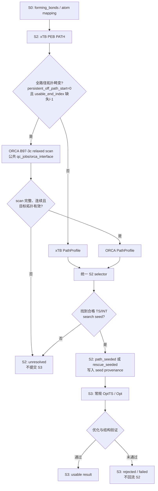
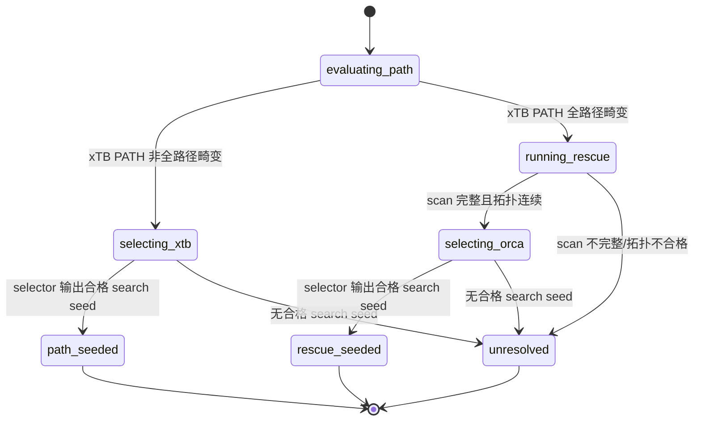
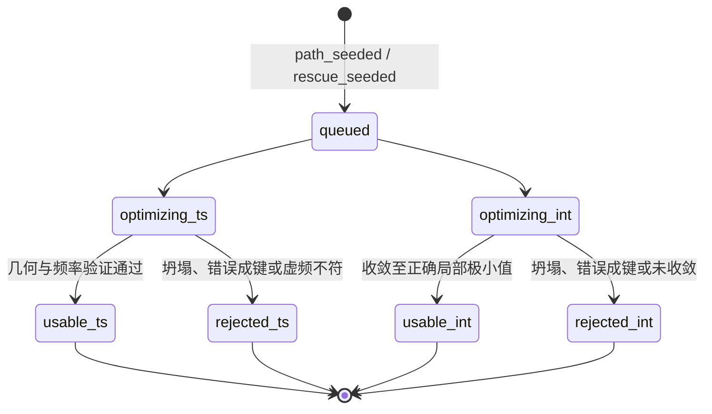

# S2 ORCA relaxed-scan 统一选点与 S2/S3 状态机修改计划

## 1. 目标与结论

将 ORCA B97-3c relaxed scan 从“必须先找到严格能量峰，否则 rescue 失败”的工具，改为 S2 的第二条高质量候选路径。它提供连续、拓扑可审查、几何更平滑的受约束路径；S2 对 xTB PEB 与 ORCA scan 使用同一套选点器，最后只向 S3 输出**搜索初猜**，而不把 S2 帧误标为已验证的 TS 或独立 INT。

本计划不改变 S3 的常规优化流程，也不将 S3 优化失败回流为 S2 rescue。S3 的职责是释放约束后优化并验证驻点；S2 的职责是保证送入 S3 的种子有明确的几何与路径证据。

## 2. 修改后的总体流程



## 3. 统一数据契约：PathProfile

无论路径来自 xTB PEB 还是 ORCA rescue，进入选点器前都转换为同一个 `PathProfile`。这是防止 rescue 分支再演化出第二套状态机的核心。

每个 `PathFrameEvidence` 应至少包含：

| 字段 | 含义 |
|---|---|
| `xyz` / `frame_index` | 结构与原始帧索引 |
| `energy_hartree`、`relative_energy_kcal_mol` | 同一路径内的能量与相对能量 |
| `reaction_coordinates` | 每根目标形成/断裂键的长度，以及归一化路径进度 |
| `topology_valid`、`topology_reason` | 目标键、非目标键、原子映射检查结果 |
| `rmsd_to_product`、`neighbor_rmsd` | 几何偏离与路径连续性 |
| `gradient_proxy`、`curvature_proxy` | 离散能量一阶、二阶差分 |
| `source` | `xtb_peb` 或 `orca_relaxed_scan` |

`PathProfile` 还应保存完整性、帧数、端点方向、被排除帧、拓扑有效区间和 `source_provenance`。ORCA 专属的 ORCA 输入、输出、`relaxscanact.dat` 路径仍写在 rescue 证据中，但不进入通用选点判断。

## 4. 通用 S2 选点逻辑

### 4.1 硬过滤（所有来源完全一致）

候选帧必须同时满足：

1. 原子映射与 S0 `forming_bonds` 一致；
2. 目标键按反应方向演化，且无非目标异常成键/断键；
3. 与相邻帧连续，未出现不可解释的大 RMSD 跳变；
4. 不属于不可信端点。扫描端点至少保留 `endpoint_exclusion_frames`（建议 2）帧缓冲，避免把受约束边界当成 TS；
5. 对双键反应，记录异步度 `abs(q1-q2)`，但不因异步本身淘汰候选。

### 4.2 能量形状分类与 seed 选择

选点器在硬过滤后将路径分为四类；这四类只是**证据类型**，不是新的 S2 运行状态。

| 形状 | TS search seed | INT search seed | `seed_evidence` |
|---|---|---|---|
| 有内部局部峰 | 峰顶或局部 B97-3c refine 后峰顶 | 峰前局部谷/平台 | `local_peak` |
| 有峰后盆地 | 峰顶 | 独立谷底 | `peak_and_basin` |
| 单调但有肩部/低斜率区 | 路径内部、满足进度阈值的肩部代表帧 | 该帧或 PRODUCT 一侧相邻的低斜率帧；无独立盆地时允许共享 | `monotonic_shoulder` |
| 严格单调且无合格肩部 | 不选 | 不选 | `none`，进入 `unresolved` |

肩部候选不等同于驻点。它必须位于扫描内部、通过几何过滤、达到最小反应坐标进度，并满足局部 `|dE/ds|` 小、二阶差分显示斜率变缓或改变趋势。当前 rx7/product_major 的 scan 应按这个规则评估；只有确实通过这些阈值，才输出 `rescue_seeded`，不能在实现前预先承诺必然选中某一帧。

### 4.3 TS/INT 的正确命名

S2 输出字段应明确区分搜索种子和已验证驻点：

```text
ts_search_seed          # 可提交 S3 OptTS 的几何
int_search_seed         # 可提交 S3 Opt 的几何
shared_search_seed      # 两者暂时同一几何，允许存在
has_independent_int=false
```

禁止在 S2 manifest 写入 `confirmed_ts`、`validated_independent_int` 等驻点结论。独立 INT 只有 S3 优化与后续频率/结构检查后才可确认。

## 5. S2/S3 最小状态机

S2 对每个 structure 只保留三个终态，避免将“峰、肩部、平台、共享 seed”等内部算法细节扩张成状态。



S3 只消费前两种 S2 结果，且绝不返回 S2：



`path_seeded` 与 `rescue_seeded` 只表示 seed 的来源不同；它们在 S3 的常规 R0 优化逻辑中同权处理。`unresolved` 表示 S2 没有可信几何，因而不会创建任何 S3 作业。

## 6. 代码修改计划

### P0：抽取并复用通用 selector

1. 在 S2 PEB 层抽取 `PathProfile`、`PathFrameEvidence` 与 `select_path_seeds(profile, policy)`；可放在 `rph_core/steps/step2_retro/` 的独立模块，避免 `peb_engine.py` 继续膨胀。
2. 让现有 xTB PEB 结果先适配为 `PathProfile`，再调用 selector；保持现有 `path_seeded` 输出语义。
3. 让 `B97CRelaxedScanRescuer` 只负责运行 ORCA、解析完整帧/能量账本、构建 ORCA `PathProfile`；不得在 rescuer 内自行判定 TS/INT。
4. 在 `peb_engine.py` 中仅按全路径畸变判据决定是否调用 rescue，并接收通用 selector 的结果写 manifest。

### P0：保留公共 ORCA 执行职责

- `rph_core/utils/orca_interface.py`：保留 `run_surface_scan` 及 `.relaxscanact.dat` 优先能量解析；不加入 S2 选点策略。
- `rph_core/utils/qc_jobs.py`：保留 `SurfaceScanSpec` 与全局理论/资源映射；不加入救援判定。
- `config/defaults.yaml`：ORCA 方法、溶剂、`resources.nproc`、超时仍为全局配置；S2 仅持有 scan 范围、点数和 selector 阈值等策略参数。

### P1：新增 policy 配置

建议在 S2 PEB 的 rescue policy 下新增而非硬编码：

```yaml
selection:
  endpoint_exclusion_frames: 2
  min_reaction_progress: 0.35
  min_valid_neighbor_window: 1
  allow_monotonic_shoulder: true
  shoulder_max_abs_slope_kcal_mol_per_A: <calibrate>
  shoulder_min_curvature_signal: <calibrate>
  allow_shared_search_seed: true
```

阈值不得仅凭 rx7 单例固定。先以现有成功 S3 的 TS/INT 案例回放，统计它们在归一化路径进度、斜率、曲率和端点距离上的分布，再确定默认值。

### P1：manifest 与 UI/可视化

每个 S2 structure record 新增：

```json
{
  "selection_source": "xtb_peb | orca_relaxed_scan",
  "s2_state": "path_seeded | rescue_seeded | unresolved",
  "seed_evidence": "local_peak | peak_and_basin | monotonic_shoulder | none",
  "ts_search_seed": {"frame_index": 0, "xyz": "...", "confidence": "high | medium"},
  "int_search_seed": {"frame_index": 0, "xyz": "...", "shared_with_ts": false},
  "has_independent_int": false,
  "rejection_reason": null
}
```

复用现有 `s2_profile_figures.py` 与 scan profile 绘图模块，在同一张能量图叠加：拓扑排除区、有效帧、TS/INT search seed、端点排除区、`seed_evidence` 与候选置信度。终端 UI 应显示 `rescue → selecting_orca → rescue_seeded/unresolved`，而不是只显示 rescue 作业完成。

## 7. 测试与验收

### 单元测试

1. 干净 xTB 路径：不触发 rescue，输出 `path_seeded`。
2. xTB 的 TS/INT 同一帧：允许 `shared_search_seed`，仍输出 `path_seeded`。
3. 全路径畸变 + ORCA 内部峰：输出 `rescue_seeded`，峰顶为 TS seed。
4. 全路径畸变 + ORCA 肩部：满足阈值时输出 `rescue_seeded`，证据为 `monotonic_shoulder`。
5. 全路径畸变 + 严格单调且无肩部：输出 `unresolved`，不生成 S3 作业。
6. 端点最高能但无支撑帧：端点必须被排除，不能成为 TS seed。
7. ORCA 能量账本不完整、帧数不匹配或拓扑漂移：输出 `unresolved` 并保留诊断。

### 集成测试

1. rx7/product_major：验证 17 帧账本、UI 事件、profile 图和统一 selector 的实际判定；其预期不是固定状态，而是“仅在肩部条件满足时 `rescue_seeded`”。
2. rx6 与 rx8：确认有可用 xTB 路径时不意外触发 rescue。
3. 选择一个已成功完成 S3 的 TS/INT 反应作回放基准，确认新 selector 不降低原有 seed 的可用性。
4. 对每个 `rescue_seeded`，确认 S3 只创建正常 TS/INT 优化作业；对每个 `unresolved`，确认 S3 manifest 不出现伪造 job。

### 验收标准

- S2 不再把 ORCA scan 的“无严格峰”自动等同为执行失败；
- S2 不把受约束扫描端点伪装为 TS；
- 任一 S3 job 都能追溯到 xTB 或 ORCA 的具体帧、筛选证据与图；
- S3 坍塌不会触发新的 S2 rescue；
- ORCA 理论层级、并行与超时只来自公共 QC 配置；
- 成功案例回放与 rx7 实例均通过 manifest、UI、图和作业数检查。

## 8. 实施顺序与风险控制

1. 先实现数据适配与通用 selector，但保持旧 xTB 选点结果对比输出；
2. 用历史成功案例标定阈值，再接通 ORCA selection；
3. 开启 ORCA rescue 到 `rescue_seeded` 的 S3 提交；
4. 最后清理旧 rescue 的“只有峰才能成功”分支。

最大风险是把高能的 scan 端点或纯解离方向误作为 TS 初猜。端点排除、拓扑过滤、反应进度、肩部判定和 S3 不回流是防线；其中任何一项失败时，宁可 `unresolved`，不能伪造 TS/INT。
